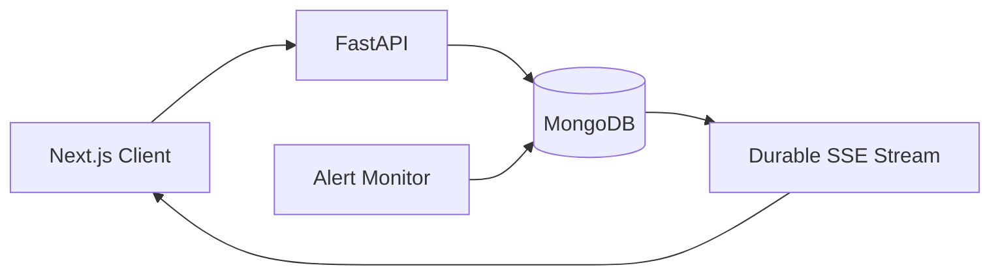

<div align="center">

# MarketPulse AI

### Realtime Equity Research & Portfolio Intelligence

A production-focused fintech platform for market research, paper trading, portfolio risk analysis, watchlists, and resumable realtime price alerts.


</div>

---

## Overview

MarketPulse AI demonstrates how a fintech application can preserve ordered realtime data across connection drops and service restarts.

It uses deterministic simulated market data, making the project repeatable, testable, and free from paid API dependencies.

## Features

- Streaming stock analysis with resumable SSE
- Simulated NSE quotes and OHLCV history
- Fundamental statements and financial ratios
- Paper BUY/SELL transactions with idempotency
- Realized and unrealized P&L
- Portfolio allocation and risk analytics
- Watchlists with automatic price alerts
- Durable realtime notification history
- Cursor-based replay and client deduplication
- Premium responsive Next.js dashboard

## Architecture



MongoDB owns event history and ordering. SSE connections are only a delivery mechanism, so reconnecting clients can safely replay missed events.

## Technology

| Area | Stack |
|---|---|
| Frontend | Next.js, TypeScript, Tailwind CSS, Recharts |
| Backend | FastAPI, Python 3.13 |
| Database | MongoDB |
| Realtime | Server-Sent Events |
| Testing | Pytest, Vitest |
| Infrastructure | Docker |

## Realtime Contract

Every event has a stable identity and ordered sequence:

```json
{
  "id": "event-id",
  "sequence": 12,
  "type": "price_alert_triggered",
  "source_id": "alert-id",
  "payload": {},
  "created_at": "2026-09-30T12:00:00Z"
}
```

Clients reconnect using their last cursor:

```http
GET /api/notifications/events?cursor=12
```

The server returns only events where `sequence > cursor`. Replayed and live events use the same durable log, preventing gaps and duplicate display.

## Financial Capabilities

- EPS, P/E and P/B
- ROE and ROCE
- Net profit margin
- Revenue growth
- Debt-to-equity
- Annualized return and volatility
- Sharpe ratio
- Maximum drawdown
- Historical 95% Value at Risk
- Portfolio concentration

## Local Setup

### Backend

```bash
cd backend
python -m venv .venv
pip install -r requirements.txt
uvicorn app.main:app --reload --port 8000
```

### Frontend

```bash
cd frontend
npm install
npm run dev
```

Open:

```text
Frontend: http://localhost:3000
Swagger:  http://localhost:8000/docs
```

## Environment

Backend `.env`:

```env
MONGODB_URL=mongodb://localhost:27017
MONGODB_DATABASE=marketpulse_ai
FRONTEND_URL=http://localhost:3000
ENABLE_ALERT_MONITOR=true
ALERT_EVALUATION_INTERVAL_SECONDS=15
```

Frontend `.env.local`:

```env
NEXT_PUBLIC_API_URL=http://localhost:8000
```

## Testing

```bash
# Backend
cd backend
pytest -v

# Frontend
cd frontend
npm test
npm run build
```

## Verified Reconnection Benchmarks

| Benchmark | Events | Missing | Duplicates | Result |
|---|---:|---:|---:|---|
| Analysis stream | 45 | 0 | 0 | Passed |
| Notification stream | 30 | 0 | 0 | Passed |

Run:

```bash
python -m scripts.benchmark_reconnect
python -m scripts.benchmark_notification_reconnect
```

## Key Engineering Decisions

- **SSE:** well-suited for one-way server-to-browser delivery
- **MongoDB event log:** durable replay across connection failures
- **Server-owned sequence:** deterministic ordering and cursor recovery
- **Atomic alert transition:** prevents repeated triggers
- **Client deduplication:** protects against replay/live overlap
- **Single API worker:** avoids duplicate in-process alert monitors

For horizontal scaling, the alert monitor would move into a dedicated worker with an outbox or queue.

## Disclaimer

Market prices and financial statements are deterministic simulated data. This project is for software engineering demonstration only and is not investment advice.

---

<div align="center">

Built by **Sanjana Patel**

Realtime systems · FinTech · Python · TypeScript

</div>
