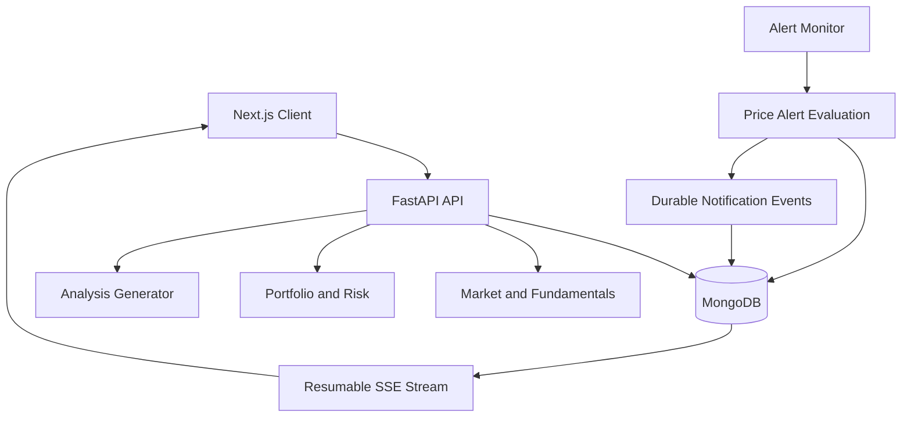

# MarketPulse AI

MarketPulse AI is a full-stack equity research and portfolio intelligence platform built around durable realtime delivery.

It combines simulated market data, fundamental analysis, paper portfolio accounting, risk analytics, watchlists, automatic price alerts, and resumable SSE notifications.

> All market and fundamental data in the current demo is deterministic and simulated. This project does not provide investment advice.

## Key Features

### Resumable AI Analysis

- Deterministic stock-analysis generator
- Ordered streamed text events
- Durable MongoDB event history
- Cursor-based SSE replay
- Client-side deduplication
- Bounded reconnect attempts
- Explicit running, completed, failed, and interrupted states
- Honest service-restart recovery

### Market Intelligence

- NSE stock master
- Simulated quotes
- 30/60/90-day OHLCV history
- Price and volume charts
- Fundamental statements
- Financial ratio engine:
  - EPS
  - Book value per share
  - P/E and P/B
  - ROE and ROCE
  - Net profit margin
  - Revenue growth
  - Debt-to-equity
  - Current ratio

### Paper Portfolio

- Immutable transaction ledger
- BUY and SELL trades
- Server-defined execution price
- Idempotency keys
- Cash and oversell validation
- Weighted-average cost basis
- Realized and unrealized P&L
- Portfolio allocation and performance views

### Risk Analytics

- Annualized return
- Annualized volatility
- Sharpe ratio
- Maximum drawdown
- Historical 95% Value at Risk
- Position concentration
- Largest holding exposure

### Watchlists and Alerts

- Multiple watchlists
- Equity tracking
- Price-above and price-below conditions
- Automatic background evaluation
- Atomic one-time alert transitions
- Durable notification events
- Premium watchlist and alert UI

### Realtime Notifications

- Server-Sent Events
- Globally ordered notification sequences
- Durable notification history
- Cursor stored in browser storage
- Replay after connection interruption
- Replay/live deduplication
- Exponential reconnect backoff
- Connected, reconnecting, and disconnected states
- Global notification bell, drawer, and toast

## Technology Stack

| Layer | Technology |
|---|---|
| Frontend | Next.js, React, TypeScript, Tailwind CSS |
| Backend | FastAPI, Python 3.13 |
| Database | MongoDB |
| Realtime | Server-Sent Events |
| Backend testing | Pytest |
| Frontend testing | Vitest |
| Visualization | Recharts |
| Containerization | Docker |
| Data provider | Deterministic simulated providers |

## Architecture



MongoDB is the source of truth for both replayed and newly produced events. Transient connections do not own event history.

## Realtime Protocol

Every streamed event contains:

```json
{
  "id": "stable-event-id",
  "sequence": 12,
  "type": "price_alert_triggered",
  "source_id": "stable-source-id",
  "source_type": "price_alert",
  "payload": {},
  "created_at": "2026-09-30T12:00:00Z"
}
```

The event `sequence` is the server-owned ordering position and client resume cursor.

A reconnect request looks like:

```text
GET /api/notifications/events?cursor=12
```

The server returns only events where:

```text
sequence > cursor
```

The client also deduplicates using the sequence before rendering.

## Replay-to-Live Safety

Replay and live delivery use the same durable MongoDB event log:

1. Client sends its latest cursor.
2. Server queries all durable events after the cursor.
3. Each delivered sequence becomes the new checkpoint.
4. Server continues querying after the latest delivered sequence.
5. Events created during replay are delivered by the next query.
6. The client rejects sequences at or below its checkpoint.

This avoids an unsafe handoff between separate replay and in-memory live channels.

## Restart Semantics

### Analysis runs

If the service restarts while an analysis is running:

- Persisted text events remain available.
- The run transitions to `interrupted`.
- A terminal interrupted event is repaired if necessary.
- The service does not silently create an unrelated replacement run.

### Price alerts

Triggered alert state is durable. Every evaluation cycle reconciles triggered alerts with notification events, so a temporary failure between state transition and notification persistence can be repaired idempotently.

## Cursor Error Handling

The notification stream explicitly rejects:

- Negative cursors
- Unknown future cursors
- Missing cursors
- Cursors older than retained history

Example:

```json
{
  "detail": {
    "code": "STALE_CURSOR",
    "message": "The requested cursor is older than the retained notification history.",
    "recoverable": true,
    "earliest_available_cursor": 51,
    "latest_available_cursor": 100
  }
}
```

The client can reset to cursor `0` to replay all currently retained events.

## Project Structure

```text
marketpulse-ai/
├── backend/
│   ├── app/
│   │   ├── api/
│   │   ├── core/
│   │   ├── models/
│   │   ├── repositories/
│   │   ├── services/
│   │   └── workers/
│   ├── scripts/
│   ├── tests/
│   ├── Dockerfile
│   └── requirements.txt
├── frontend/
│   ├── src/
│   │   ├── app/
│   │   └── features/
│   │       ├── analysis/
│   │       ├── notifications/
│   │       └── watchlist/
│   ├── Dockerfile
│   └── package.json
└── README.md
```

## Local Setup

### Requirements

- Python 3.13
- Node.js 20
- MongoDB
- npm
- Git

### Backend

```bash
cd backend

python -m venv .venv
```

Windows PowerShell:

```powershell
.\.venv\Scripts\Activate.ps1
pip install -r requirements.txt
uvicorn app.main:app --reload --port 8000
```

Backend:

```text
http://localhost:8000
```

Swagger:

```text
http://localhost:8000/docs
```

### Frontend

```bash
cd frontend
npm install
npm run dev
```

Frontend:

```text
http://localhost:3000
```

## Environment Variables

Backend `.env` example:

```env
APP_NAME=MarketPulse AI
MONGODB_URL=mongodb://localhost:27017
MONGODB_DATABASE=marketpulse_ai
FRONTEND_URL=http://localhost:3000

ENABLE_ALERT_MONITOR=true
ALERT_EVALUATION_INTERVAL_SECONDS=15
```

Use the exact MongoDB variable names defined in `app/core/config.py`.

Frontend `.env.local`:

```env
NEXT_PUBLIC_API_URL=http://localhost:8000
```

Never commit real `.env` files.

## Important API Endpoints

| Method | Endpoint | Purpose |
|---|---|---|
| POST | `/api/analyses` | Start deterministic analysis |
| GET | `/api/runs/{run_id}` | Inspect durable run state |
| GET | `/api/runs/{run_id}/events` | Resumable analysis SSE |
| GET | `/api/market/stocks` | List supported equities |
| GET | `/api/market/quotes/{symbol}` | Get simulated quote |
| GET | `/api/market/stocks/{symbol}/history` | Get OHLCV history |
| GET | `/api/market/stocks/{symbol}/fundamentals` | Get fundamentals and ratios |
| POST | `/api/portfolios` | Create paper portfolio |
| POST | `/api/portfolios/{id}/trades` | Record BUY/SELL transaction |
| GET | `/api/portfolios/{id}/summary` | Portfolio valuation and P&L |
| GET | `/api/portfolios/{id}/risk` | Portfolio risk analytics |
| GET | `/api/watchlists` | List watchlists |
| POST | `/api/watchlists/{id}/items` | Add equity |
| POST | `/api/watchlists/{id}/alerts` | Create price alert |
| POST | `/api/watchlists/alerts/evaluate` | Manually evaluate alerts |
| GET | `/api/notifications` | Durable notification history |
| GET | `/api/notifications/events` | Resumable notification SSE |
| GET | `/api/health` | Service health |

## Testing

Backend:

```bash
cd backend
pytest -v
```

Frontend:

```bash
cd frontend
npm test
npm run build
```

Tests cover:

- Ordered live delivery
- Replay after cursor
- Replay/live overlap
- Deduplication
- Generator failure after partial output
- Explicit restart interruption
- Alert condition boundaries
- Risk calculations
- Notification cursor validation
- Frontend event merge and cursor parsing

## Verification Benchmarks

Analysis reconnect benchmark:

```bash
cd backend
python -m scripts.benchmark_reconnect
```

Observed verified result:

```text
Observed events: 45
Text events: 44
Duplicate events: 0
Missing events: 0
Final run state: completed
BENCHMARK PASSED
```

Notification reconnect benchmark:

```bash
python -m scripts.benchmark_notification_reconnect
```

Observed verified result:

```text
Observed events: 30
Events before disconnect: 10
Events replayed: 20
Duplicate events: 0
Missing events: 0
Ordered: True
NOTIFICATION BENCHMARK PASSED
```

## Docker

Build the backend image:

```bash
docker build -t marketpulse-backend ./backend
```

Build the frontend image:

```bash
docker build \
  --build-arg NEXT_PUBLIC_API_URL=http://localhost:8000 \
  -t marketpulse-frontend \
  ./frontend
```

The backend currently runs with one Uvicorn worker because the alert monitor runs inside the API process. In a horizontally scaled production deployment, the monitor should be moved to a dedicated worker.

## Production Considerations

A production version would add:

- Authentication and user-owned portfolios
- Real licensed market-data provider
- Separate alert worker service
- MongoDB replica set and transactions or an outbox pattern
- Redis-backed work queues
- Notification retention policy
- Rate limiting and audit logs
- Observability, tracing, and alerting
- Secure secret management
- Automated CI/CD

### Retaining only the latest 50 events

If only the latest 50 events are retained and a client presents an older cursor, the server must not silently continue from the oldest available event.

It returns a recoverable `STALE_CURSOR` response containing the earliest and latest available positions. The client can then request a fresh snapshot and reset its cursor.

## Important Trade-off

SSE was selected because delivery is primarily server-to-client, browser support is strong, reconnection semantics are simple, and each event can carry an ordered ID.

Unlike WebSockets, SSE does not provide bidirectional messaging. Client actions continue to use regular HTTP endpoints, which keeps this prototype simpler and easier to test.

## Disclaimer

This project uses deterministic simulated market and financial data for software demonstrations and automated testing. It is not intended for trading or investment decisions.

## Author

**Anil Patel**

Full-stack developer focused on realtime systems, fintech workflows, Python backend engineering, and production-grade web applications.
